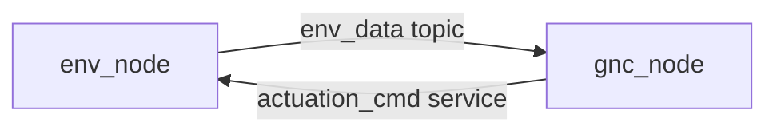

# ASTRO

ASTRO, short for **Autonomous Satellite Test & Robotics Operations**, is a ROS 2-based framework for connecting satellite simulation software and guidance, navigation, and control software in a modular way.

The current `main` branch contains an initial working ROS 2 package, `distributed_satellite_sim`, which ports a DLQR-based reference scenario from the STAR Lab standalone C++ executables into native ROS 2 nodes. The broader project direction, including native ROS 2 and bridge-based architectures, is documented in the `no-merge/manuscripts` branch.

## Overview

The project is intended to replace ad hoc simulation-to-flight-software networking with a ROS 2 graph that is easier to extend, test, and integrate with other lab systems.

On `main`, the implemented path is:

- an environment node that advances the simulation state
- a GNC node that computes control using a fixed DLQR gain matrix
- a ROS 2 topic carrying state from environment to controller
- a ROS 2 service carrying actuator commands from controller back to the environment

At a project level, the design goal is broader than the current package. The manuscript branch describes two intended deployment modes:

- a fully internal ROS 2 configuration, where simulation and control both live inside the ROS 2 graph
- an external-simulator configuration, where a bridge adapts a non-ROS simulator to the same ROS 2 interfaces

## Current package

The active package lives under [`src/DistributedSatelliteSim`](src/DistributedSatelliteSim).

Implemented components:

- `env_node`
- `gnc_node`
- `ActuationCmd.srv`
- `sim.launch.py`
- environment-node unit tests

At the package level, the interfaces are:

- topic: `env_data`
- service: `actuation_cmd`
- launch argument: `max_steps`

The current implementation is a ROS 2 port of the DLQR reference code in:

- [`reference/DLQR/udp_roundtrip_discrete.cpp`](reference/DLQR/udp_roundtrip_discrete.cpp)
- [`reference/DLQR/udp_hcw_discrete_txrx 2 1.cpp`](reference/DLQR/udp_hcw_discrete_txrx%202%201.cpp)

The package currently uses a hardcoded six-state model, a three-axis control input, and a default initial state of:

```text
[20, 20, 20, 0.00930458, -0.0467472, 0.00798343]
```

Additional implementation details that are useful when modifying the package:

- `env_node` advances the model on a 100 ms wall timer
- `sim.launch.py` defaults `max_steps` to `91`
- setting `max_steps:=0` runs the simulation without the launch-time stop condition
- `env_node` currently owns the hardcoded `Ad` and `Bd` matrices directly in code
- `gnc_node` currently owns the hardcoded DLQR gain matrix directly in code
- the environment publishes `std_msgs/msg/Float64MultiArray` with six state elements
- the actuation service uses a fixed-length `float64[3]` thrust vector

## Architecture



- `env_node` publishes the simulated state on `env_data`
- `gnc_node` subscribes to `env_data`, computes `u = -Kx`, and sends thrust through `actuation_cmd`
- `sim.launch.py` starts both nodes together

In the current code, `env_node` is both the simulator and actuator sink. That is useful to keep in mind because the project-level architecture described in the manuscripts splits this more conceptually into environment dynamics, actuator modeling, and future adapter layers.

## Repository layout

```text
.
├── .devcontainer/
├── reference/
│   ├── DLQR/
│   └── QP_MPC/
└── src/
    └── DistributedSatelliteSim/
```

Key directories:

- [`src/DistributedSatelliteSim`](src/DistributedSatelliteSim): active ROS 2 package
- [`reference/DLQR`](reference/DLQR): DLQR reference executables used for the current port
- [`reference/QP_MPC`](reference/QP_MPC): QP_MPC reference code for future integration

Within [`src/DistributedSatelliteSim`](src/DistributedSatelliteSim):

- [`include/distributed_satellite_sim/env_node.hpp`](src/DistributedSatelliteSim/include/distributed_satellite_sim/env_node.hpp): current environment-node implementation
- [`src/gnc_node.cpp`](src/DistributedSatelliteSim/src/gnc_node.cpp): DLQR controller node
- [`srv/ActuationCmd.srv`](src/DistributedSatelliteSim/srv/ActuationCmd.srv): service definition
- [`launch/sim.launch.py`](src/DistributedSatelliteSim/launch/sim.launch.py): combined launch entrypoint
- [`test/test_env_node.cpp`](src/DistributedSatelliteSim/test/test_env_node.cpp): environment-node tests

## Development environment

The repository is set up for **ROS 2 Kilted** and includes OS-specific devcontainer definitions under [`.devcontainer`](.devcontainer).

The Linux devcontainer is configured around the `ghcr.io/accommodus/astro:latest` image and sets `ROS_AUTOMATIC_DISCOVERY_RANGE=LOCALHOST` and `ROS_DOMAIN_ID=42`. Those defaults matter if you are debugging node discovery behavior or trying to compare container and non-container runs.

If you are not using the devcontainer, you will need:

- ROS 2 Kilted
- `colcon`
- `rosdep`
- Eigen3
- a C++17-capable compiler

## Build

From the repository root:

```bash
source /opt/ros/kilted/setup.bash
rosdep update
rosdep install --from-paths src --ignore-src -y
colcon build --packages-select distributed_satellite_sim
source install/setup.bash
```

## Run

Launch the full DLQR demo:

```bash
ros2 launch distributed_satellite_sim sim.launch.py
```

Set an explicit step limit:

```bash
ros2 launch distributed_satellite_sim sim.launch.py max_steps:=91
```

Run nodes individually:

```bash
ros2 run distributed_satellite_sim env_node
ros2 run distributed_satellite_sim gnc_node
```

Useful inspection commands:

```bash
ros2 topic echo /env_data
ros2 service call /actuation_cmd distributed_satellite_sim/srv/ActuationCmd "{thrust: [0.0, 0.0, 0.0]}"
```

When running nodes individually, start `env_node` first so the `actuation_cmd` service exists before `gnc_node` begins trying to send requests.

## Testing

Run the package tests with:

```bash
source /opt/ros/kilted/setup.bash
colcon test --packages-select distributed_satellite_sim
colcon test-result --verbose
```

The current tests cover:

- zero-thrust propagation
- non-zero-thrust propagation
- default initial state behavior
- service success responses
- topic message sizing

The current test coverage is focused on the environment node. There is not yet a committed end-to-end regression test that launches both nodes and compares the full closed-loop trajectory against the original standalone reference output.

## Roadmap

Near-term work is centered on:

- validating the ROS 2 DLQR implementation against the original reference executables
- adding end-to-end integration testing
- parameterizing the environment model for alternate controller configurations
- integrating the QP_MPC controller path later

The `reference/QP_MPC` code is already in the repository, but it is not wired into the ROS 2 package yet and uses different dynamics and timing than the current DLQR environment.

That difference is significant: the QP_MPC path is not just a second controller implementation. It will require environment reconfiguration as well, because the reference code uses different matrices, timing, and scenario assumptions than the current DLQR node pair.

## Current limitations

- the environment dynamics are hardcoded rather than configured through parameters or YAML
- the launch flow currently targets the DLQR scenario only
- the external simulator bridge described in the project manuscripts is not implemented on `main`
- [`src/DistributedSatelliteSim/package.xml`](src/DistributedSatelliteSim/package.xml) still has placeholder license metadata

## Additional project context

The `no-merge/manuscripts` branch contains the proposal, presentation, and progress reports for the broader ASTRO project:

- [manuscripts branch](https://github.com/Accommodus/ASTRO/tree/no-merge/manuscripts)
- [presentation](https://github.com/Accommodus/ASTRO/blob/no-merge/manuscripts/presentation/main.typ)
- [proposal](https://github.com/Accommodus/ASTRO/tree/no-merge/manuscripts/proposal)

Those materials are useful if you want the higher-level rationale for the project, especially:

- why the lab wants ROS 2 instead of ad hoc UDP coupling
- the distinction between internal ROS 2 and bridge-based simulator architectures
- the intended longer-term expansion toward alternate controllers and operator-facing tooling
