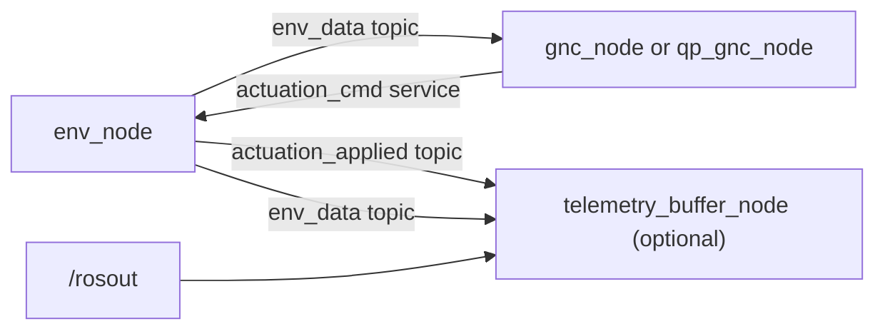
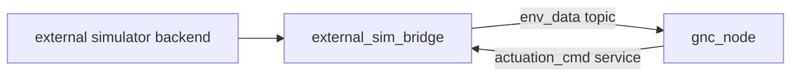

# ASTRO

ASTRO, short for **Autonomous Satellite Test & Robotics Operations**, is a ROS 2-based framework for running closed-loop satellite simulation and control software with a cleaner, more modular interface than the older ad hoc lab setup.

On `main`, the repository now contains two active ROS 2 packages:

- [`src/DistributedSatelliteSim`](src/DistributedSatelliteSim): the primary simulation-and-control package
- [`src/external_sim_bridge`](src/external_sim_bridge): an adapter package for validating external simulator backends against the same ROS-facing interface

## Start Here

Use these documents in this order:

1. **This README**: what exists on `main`, how to build it, and how to run the common paths.
2. [`demo/README.md`](demo/README.md): two-machine Docker Compose deployment for ENV/GNC and showcase use.
3. [`docs/next-phase-plan.md`](docs/next-phase-plan.md): current roadmap and planned next-phase work.
4. `no-merge/manuscripts`: project proposal, reports, and broader rationale. Treat that branch as historical/project-context documentation, not as the operational source of truth for the current codebase.

## What The System Does

At a high level, ASTRO connects a simulator and a controller through ROS 2:

- an **environment node** publishes the current simulated satellite state
- a **controller node** reads that state and computes a thrust command
- a ROS 2 **service** sends that thrust command back to the environment
- optional telemetry tooling records recent state, actuation, and log history

On `main`, that idea exists in two forms:

- an internal ROS 2 simulation path inside `distributed_satellite_sim`
- an external-simulator bridge path inside `external_sim_bridge`

## Current State On `main`

The following are implemented on `main`:

- a validated **DLQR closed-loop baseline** with `env_node` and `gnc_node`
- a **QP-MPC controller path** with separate launch/configuration support
- a **telemetry buffer node** that stores recent environment, actuation, and `/rosout` log history
- **parameterized environment dynamics** through YAML/config instead of hardcoded-only launch behavior
- a Python **external simulator bridge** package with fake and Basilisk-oriented backends
- **distributed deployment support** through Docker Compose for local LAN and Tailscale-based two-machine runs
- automated tests for both packages, including unit tests and launch/integration-style tests

## Architecture

### Internal ROS 2 path


```mermaid
flowchart LR
    ENV["env_node"] -- "env_data topic" --> GNC["gnc_node or qp_gnc_node"]
    GNC -- "actuation_cmd service" --> ENV
    ENV -- "actuation_applied topic" --> BUF["telemetry_buffer_node (optional)"]
    ENV -- "env_data topic" --> BUF
    ROSOUT["/rosout"] --> BUF
```

### External bridge path


```mermaid
flowchart LR
    SIM["external simulator backend"] --> BRIDGE["external_sim_bridge"]
    BRIDGE -- "env_data topic" --> GNC["gnc_node"]
    GNC -- "actuation_cmd service" --> BRIDGE
```

## Key Interfaces

The most important ROS-facing interfaces are:

- topic: `env_data`
  Carries the six-state vector `[x, y, z, vx, vy, vz]`
- service: `actuation_cmd`
  Carries a fixed-length `float64[3]` thrust command
- topic: `actuation_applied`
  Publishes the thrust command actually stored by the environment node
- services:
  `/telemetry_buffer/get_recent_env_history`
  `/telemetry_buffer/get_recent_actuation_history`
  `/telemetry_buffer/get_recent_log_history`

## Repository Layout

```text
.
├── .devcontainer/
├── .docker/
├── demo/
├── docs/
├── reference/
└── src/
    ├── DistributedSatelliteSim/
    └── external_sim_bridge/
```

Key directories:

- [`src/DistributedSatelliteSim`](src/DistributedSatelliteSim): main ROS 2 simulation/control package
- [`src/external_sim_bridge`](src/external_sim_bridge): external simulator adapter package
- [`demo`](demo): two-machine Docker Compose deployment docs and configs
- [`docs/next-phase-plan.md`](docs/next-phase-plan.md): forward-looking roadmap and planned work
- [`reference`](reference): original reference code and supporting assets used for comparison and future controller work

Within [`src/DistributedSatelliteSim`](src/DistributedSatelliteSim), the main files to know are:

- [`include/distributed_satellite_sim/env_node.hpp`](src/DistributedSatelliteSim/include/distributed_satellite_sim/env_node.hpp): environment simulation node
- [`include/distributed_satellite_sim/gnc_node.hpp`](src/DistributedSatelliteSim/include/distributed_satellite_sim/gnc_node.hpp): DLQR controller node
- [`include/distributed_satellite_sim/qp_gnc_node.hpp`](src/DistributedSatelliteSim/include/distributed_satellite_sim/qp_gnc_node.hpp): QP-MPC controller node
- [`include/distributed_satellite_sim/telemetry_buffer_node.hpp`](src/DistributedSatelliteSim/include/distributed_satellite_sim/telemetry_buffer_node.hpp): circular history buffer node
- [`config/dlqr_params.yaml`](src/DistributedSatelliteSim/config/dlqr_params.yaml): DLQR scenario configuration
- [`config/qp_mpc_params.yaml`](src/DistributedSatelliteSim/config/qp_mpc_params.yaml): QP-MPC scenario configuration
- [`launch/sim.launch.py`](src/DistributedSatelliteSim/launch/sim.launch.py): default DLQR launch entrypoint with optional telemetry buffer
- [`launch/qp_mpc_launch.py`](src/DistributedSatelliteSim/launch/qp_mpc_launch.py): QP-MPC launch entrypoint

Within [`src/external_sim_bridge`](src/external_sim_bridge), start with:

- [`external_sim_bridge/bridge_node.py`](src/external_sim_bridge/external_sim_bridge/bridge_node.py): generic bridge logic
- [`external_sim_bridge/backends`](src/external_sim_bridge/external_sim_bridge/backends): fake and Basilisk backend implementations
- [`launch/bridge_sim.launch.py`](src/external_sim_bridge/launch/bridge_sim.launch.py): bridge + `gnc_node` launch entrypoint
- [`doc/design_note.md`](src/external_sim_bridge/doc/design_note.md): design contract for the bridge package

## Development Environment

The repository is set up for **ROS 2 Kilted** and includes OS-specific devcontainer definitions under [`.devcontainer`](.devcontainer).

If you are not using the devcontainer, install:

- ROS 2 Kilted
- `colcon`
- `rosdep`
- Eigen3
- a C++17-capable compiler
- Python dependencies required by the ROS 2 packages

For the Basilisk bridge backend, you will also need the Basilisk Python runtime available in the active environment.

## Build

From the repository root:

```bash
source /opt/ros/kilted/setup.bash
rosdep update
rosdep install --from-paths src --ignore-src -y
colcon build --packages-select distributed_satellite_sim external_sim_bridge
source install/setup.bash
```

## Run

### 1. Run the default DLQR baseline

```bash
ros2 launch distributed_satellite_sim sim.launch.py
```

Useful launch arguments:

- `max_steps:=91`
- `min_subscribers:=1`
- `enable_telemetry_buffer:=true`
- `env_buffer_capacity:=100`
- `actuation_buffer_capacity:=100`
- `log_buffer_capacity:=100`

Example with telemetry enabled:

```bash
ros2 launch distributed_satellite_sim sim.launch.py enable_telemetry_buffer:=true
```

### 2. Run the QP-MPC path

```bash
ros2 launch distributed_satellite_sim qp_mpc_launch.py
```

This path uses [`config/qp_mpc_params.yaml`](src/DistributedSatelliteSim/config/qp_mpc_params.yaml), including a different timestep and docking-check settings than the default DLQR launch.

### 3. Run the external bridge path

Use the deterministic fake backend when you want a bridge-only validation path without Basilisk:

```bash
ros2 launch external_sim_bridge bridge_sim.launch.py backend_type:=fake
```

Use the Basilisk backend only when its runtime dependency is installed:

```bash
ros2 launch external_sim_bridge bridge_sim.launch.py backend_type:=basilisk
```

### 4. Run the two-machine deployment

For Docker Compose deployment across two machines, use [`demo/README.md`](demo/README.md). That is the source of truth for:

- local LAN runs
- Tailscale-based runs
- `ENV` versus `GNC` roles
- `ROS_DISCOVERY_PEER`, `LAN_PEER_HOST`, and related runtime variables

### Useful inspection commands

```bash
ros2 topic echo /env_data
ros2 topic echo /actuation_applied
ros2 service list
```

Example telemetry queries:

```bash
ros2 service call /telemetry_buffer/get_recent_env_history distributed_satellite_sim/srv/GetRecentEnvHistory "{limit: 5}"
ros2 service call /telemetry_buffer/get_recent_actuation_history distributed_satellite_sim/srv/GetRecentActuationHistory "{limit: 5}"
```

## Testing

Run the package tests with:

```bash
source /opt/ros/kilted/setup.bash
colcon test --packages-select distributed_satellite_sim external_sim_bridge
colcon test-result --verbose
```

Current automated coverage includes:

- `distributed_satellite_sim`
  environment-node unit tests
  DLQR GNC-node unit tests
  QP-MPC controller unit tests
  telemetry-buffer unit tests
  DLQR launch-based regression coverage
  QP-MPC convergence launch coverage
  telemetry-buffer launch coverage
- `external_sim_bridge`
  fake-backend unit tests
  bridge-node unit tests
  reference launch validation
  Basilisk-backend validation tests

## Working In The Repo

When modifying behavior, change configuration before changing code when possible:

- scenario/timing/dynamics defaults live in YAML under [`src/DistributedSatelliteSim/config`](src/DistributedSatelliteSim/config)
- controller and simulation logic live under [`src/DistributedSatelliteSim/include/distributed_satellite_sim`](src/DistributedSatelliteSim/include/distributed_satellite_sim)
- deployment behavior lives under [`demo`](demo) and [`.docker`](.docker)
- bridge behavior lives under [`src/external_sim_bridge`](src/external_sim_bridge)

## Current Limitations

- the default `sim.launch.py` path is still centered on the DLQR baseline
- the QP-MPC path uses a different scenario configuration and is not just a drop-in controller swap
- the external bridge exists on `main`, but external-simulator validation is still a less mature path than the internal DLQR baseline
- the manuscripts branch describes broader project direction than what has been fully operationalized on `main`

## Glossary

- **ROS 2**: the middleware/framework used to let different processes exchange data in a standard way.
- **Node**: a single running program in ROS 2. In this repo, `env_node`, `gnc_node`, and `telemetry_buffer_node` are examples.
- **Topic**: a one-way stream of messages. Here, `env_data` is the main state stream.
- **Service**: a request/response call. Here, `actuation_cmd` is how the controller sends thrust commands back.
- **ENV**: shorthand for the environment/simulation side of the system.
- **GNC**: shorthand for guidance, navigation, and control; here it means the controller side.
- **DLQR**: a linear-quadratic regulator used for the baseline controller on `main`.
- **QP-MPC**: a model-predictive control approach that solves an optimization problem at each step.
- **Bridge**: an adapter that lets an external simulator present the same ROS interface as the built-in environment node.
- **Telemetry buffer**: a helper node that keeps a recent rolling history of states, applied thrust, and log messages for debugging and operator support.

## Additional Project Context

The `no-merge/manuscripts` branch contains the proposal, presentation material, and written project reports for the broader ASTRO effort:

- [manuscripts branch](https://github.com/Accommodus/ASTRO/tree/no-merge/manuscripts)
- [presentation](https://github.com/Accommodus/ASTRO/blob/no-merge/manuscripts/presentations/final.typ)
- [proposal](https://github.com/Accommodus/ASTRO/tree/no-merge/manuscripts/proposal)

Those materials are useful for understanding why ASTRO exists and what the broader long-term architecture was meant to become. For current behavior on `main`, prefer this README, [`demo/README.md`](demo/README.md), and [`docs/next-phase-plan.md`](docs/next-phase-plan.md).
